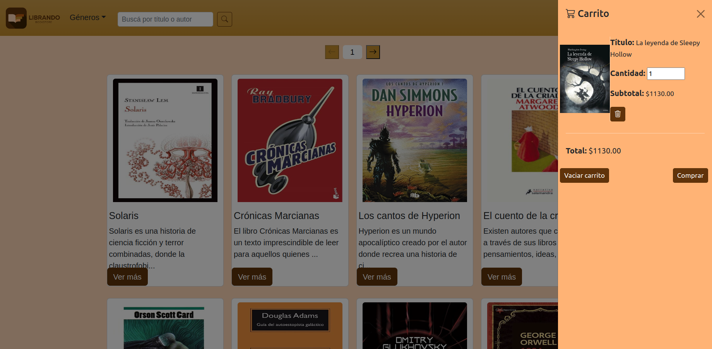

<a name="readme-top"></a>
[![Contributors][contributors-shield]][contributors-url]
[![Issues][issues-shield]][issues-url]


<!-- PROJECT LOGO -->
<br />
<div align="center">
  <a href="https://github.com/Merssith/Librando-BACK">
    
  </a>

<h3 align="center">BACKEND ECOMMERCE LIBRANDO BOOKSTORE</h3>

  <p align="center">
    Proyecto de ecommerce para bootcamp Plataforma 5
    <br />
    <a href="https://github.com/Merssith/Librando-BACK"><strong>Explora nuestro proyecto »</strong></a>
    <br />
    <br />
    <a href="https://github.com/Merssith/Librando-BACK/issues">Reportar un bug</a>
    ·
    <a href="https://github.com/Merssith/Librando-BACK/issues">Solicitar una feature</a>
  </p>
</div>


<!-- TABLE OF CONTENTS -->
<details>
  <summary>Contenido</summary>
  <ol>
    <li>
      <a href="#sobre-el-proyecto">Sobre el proyecto</a>
      <ul>
        <li><a href="#stack-de-tecnologías">Stack de tecnologías</a></li>
      </ul>
    </li>
    <li>
      <a href="#empezando">Empezando</a>
      <ul>
        <li><a href="#pre-requisitos">Pre-requisitos</a></li>
        <li><a href="#instalación">Instalación</a></li>
      </ul>
    </li>
    <li><a href="#metodos-de-api">Metodos de API</a></li>
    <li><a href="#roadmap">Roadmap</a></li>
    <li><a href="#contribuye">Contribuye</a></li>
    <li><a href="#contacto">Contacto</a></li>
    <li><a href="#agradecimientos">Agradecimientos</a></li>
  </ol>
</details>


<!-- ABOUT THE PROJECT -->
## Sobre el proyecto



“Librando” es un proyecto de e-commerce de venta de novelas.
Los usuarios podrán registrarse y navegar a través de las categorías de géneros de novelas, realizar búsquedas y comprar sus novelas favoritas fácilmente.
También contará con un módulo administrador que permitira gestionar toda la base de datos del sitio.


<p align="right">(<a href="#readme-top">volver a arriba</a>)</p>


### Stack de tecnologías

* NodeJS
* Nodemon
* Express
* Sequelize
* Postgres
* Voleyball
* Bcrypt
* JWT
* Handlebars
* Nodemailer
* FS


<p align="right">(<a href="#readme-top">volver a arriba</a>)</p>


<!-- GETTING STARTED -->
## Empezando

Actualmente la base de datos se encuentra totalmente de manera local. Por lo tanto, deberás seguir estas instrucciones para levantar el proyecto de backend.

### Pre-requisitos

Deberas complir los siguientes pre-requisitos para poder utilizar este proyecto
* DB: Crea la DB utilizando psql
  ```sh
  createdb librando
  ```

### Instalación

1. Clona el repositorio en tu local
   ```sh
   git clone https://github.com/Merssith/Librando-BACK.git
   ```
2. Instala las dependencias NPM 
   ```sh
   npm install
   ```
3. Seedea la base de datos
   ```sh
   npm run seed
   ```
4. Levanta el servidor
   ```sh
   npm run server
   ```

<p align="right">(<a href="#readme-top">volver a arriba</a>)</p>


<!-- API  -->
## Metodos de API


Puedes ver todos los metodos de la API descargando la [colección de POSTMAN](https://www.getpostman.com/collections/7cf61cf99122ccd4181f)

<p align="right">(<a href="#readme-top">volver a arriba</a>)</p>


<!-- ROADMAP -->
## Roadmap

- [x] Modulo de usuario
    - [x] Registrarse
    - [x] Login/Logout
    - [x] Persistencia de carrito y de usuario
    - [x] Buscar libros por autor y nombre del libro
    - [x] Navegar por las categorias
    - [x] Ver los detalles del libro
    - [x] Dejar una review de un libro comprado
    - [x] Recibir correos de confirmación
    - [x] Cerrar una compra
    - [x] Ver datos de usuario
    - [x] Ver compras anteriores
    
- [x] Modulo de administrador
    - [x] Ver todos los usuarios
    - [x] Promover usuarios a admin
    - [x] Eliminar usuarios
    - [x] Ver todas las ordenes
    - [x] Modificar una orden
    - [x] Agregar, editar y eliminar libros del catalogo
    - [x] Agregar, editar y eliminar generos del catalogo (categorias)
    
 - [ ] Otros
    - [ ] OAuth2


<p align="right">(<a href="#readme-top">volver a arriba</a>)</p>


<!-- CONTRIBUTING -->
## Contribuye

<p>Las contribuciones de la comunidad Dev nos ayudan a aprender, inspirarnos y crear cosas nuevas! Todas las contrinuciones seran muy bienvenidas!</p>
<p>Si tienes algunas sugerencia para mejorar nuestro proyecto, por favor forkea el repositorio y crea un pull request.</p>
<p>Muchas gracias!</p>

1. Forkea el repositorio
2. Crea tu branch (`git checkout -b feature/MiFeature`)
3. Comitea tus cambios (`git commit -m 'Agrego MiFeature'`)
4. Pushea a la branch (`git push origin feature/MiFeature`)
5. Abri un pull request

<p align="right">(<a href="#readme-top">volver a arriba</a>)</p>


<!-- CONTACT -->
## Contacto

* Mercedes Salcedo - mercedes.salcedo1989@gmail.com
* Franco Livelli - franco.livelli@gmail.com
* Mikelzon Sarabia - Mikelzonsarabia@gmail.com
* Alberto Carrillo de Comas - albertokarri@gmail.com
* Diego Siboldi - die.siboldi@gmail.com
* Julian Pacheco - jpjulianpacheco@gmail.com

Link del proyecto: [https://github.com/Merssith/Librando-BACK](https://github.com/Merssith/Librando-BACK)

<p align="right">(<a href="#readme-top">volver a arriba</a>)</p>


<!-- ACKNOWLEDGMENTS -->
## Agradecimientos

* A Pablo Burgos
* A todo el staff de Plataforma 5
* A los jurados
* A nuestros compañeros de bootcamp

<p align="right">(<a href="#readme-top">volver a arriba</a>)</p>


<!-- MARKDOWN LINKS & IMAGES -->
<!-- https://www.markdownguide.org/basic-syntax/#reference-style-links -->
[contributors-shield]: https://img.shields.io/github/contributors/Merssith/Librando-BACK.svg?style=for-the-badge
[contributors-url]: https://github.com/Merssith/Librando-BACK/graphs/contributors
[forks-shield]: https://img.shields.io/github/forks/Merssith/Librando-BACK.svg?style=for-the-badge
[forks-url]: https://github.com/Merssith/Librando-BACK/network/members
[stars-shield]: https://img.shields.io/github/stars/Merssith/Librando-BACK.svg?style=for-the-badge
[stars-url]: https://github.com/Merssith/Librando-BACK/stargazers
[issues-shield]: https://img.shields.io/github/issues/Merssith/Librando-BACK.svg?style=for-the-badge
[issues-url]: https://github.com/Merssith/Librando-BACK/issues
[license-shield]: https://img.shields.io/github/license/Merssith/Librando-BACK.svg?style=for-the-badge
[license-url]: https://github.com/Merssith/Librando-BACK/blob/master/LICENSE.txt
[linkedin-shield]: https://img.shields.io/badge/-LinkedIn-black.svg?style=for-the-badge&logo=linkedin&colorB=555
[linkedin-url]: https://linkedin.com/in/linkedin_username
[Next.js]: https://img.shields.io/badge/next.js-000000?style=for-the-badge&logo=nextdotjs&logoColor=white
[Next-url]: https://nextjs.org/
[React.js]: https://img.shields.io/badge/React-20232A?style=for-the-badge&logo=react&logoColor=61DAFB
[React-url]: https://reactjs.org/
[Vue.js]: https://img.shields.io/badge/Vue.js-35495E?style=for-the-badge&logo=vuedotjs&logoColor=4FC08D
[Vue-url]: https://vuejs.org/
[Angular.io]: https://img.shields.io/badge/Angular-DD0031?style=for-the-badge&logo=angular&logoColor=white
[Angular-url]: https://angular.io/
[Svelte.dev]: https://img.shields.io/badge/Svelte-4A4A55?style=for-the-badge&logo=svelte&logoColor=FF3E00
[Svelte-url]: https://svelte.dev/
[Laravel.com]: https://img.shields.io/badge/Laravel-FF2D20?style=for-the-badge&logo=laravel&logoColor=white
[Laravel-url]: https://laravel.com
[Bootstrap.com]: https://img.shields.io/badge/Bootstrap-563D7C?style=for-the-badge&logo=bootstrap&logoColor=white
[Bootstrap-url]: https://getbootstrap.com
[JQuery.com]: https://img.shields.io/badge/jQuery-0769AD?style=for-the-badge&logo=jquery&logoColor=white
[JQuery-url]: https://jquery.com/Librando-BACK.svg?style=for-the-badge
[contributors-url]: https://github.com/Merssith/Librando-BACK/graphs/contributors
[forks-shield]: https://img.shields.io/github/forks/Merssith/Librando-BACK.svg?style=for-the-badge
[forks-url]: https://github.com/Merssith/Librando-BACK/network/members
[stars-shield]: https://img.shields.io/github/stars/Merssith/Librando-BACK.svg?style=for-the-badge
[stars-url]: https://github.com/Merssith/Librando-BACK/stargazers
[issues-shield]: https://img.shields.io/github/issues/Merssith/Librando-BACK.svg?style=for-the-badge
[issues-url]: https://github.com/Merssith/Librando-BACK/issues
[license-shield]: https://img.shields.io/github/license/Merssith/Librando-BACK.svg?style=for-the-badge
[license-url]: https://github.com/Merssith/Librando-BACK/blob/master/LICENSE.txt
[linkedin-shield]: https://img.shields.io/badge/-LinkedIn-black.svg?style=for-the-badge&logo=linkedin&colorB=555
[linkedin-url]: https://linkedin.com/in/linkedin_username
[product-screenshot]: images/project.png
[Next.js]: https://img.shields.io/badge/next.js-000000?style=for-the-badge&logo=nextdotjs&logoColor=white
[Next-url]: https://nextjs.org/
[React.js]: https://img.shields.io/badge/React-20232A?style=for-the-badge&logo=react&logoColor=61DAFB
[React-url]: https://reactjs.org/
[Vue.js]: https://img.shields.io/badge/Vue.js-35495E?style=for-the-badge&logo=vuedotjs&logoColor=4FC08D
[Vue-url]: https://vuejs.org/
[Angular.io]: https://img.shields.io/badge/Angular-DD0031?style=for-the-badge&logo=angular&logoColor=white
[Angular-url]: https://angular.io/
[Svelte.dev]: https://img.shields.io/badge/Svelte-4A4A55?style=for-the-badge&logo=svelte&logoColor=FF3E00
[Svelte-url]: https://svelte.dev/
[Laravel.com]: https://img.shields.io/badge/Laravel-FF2D20?style=for-the-badge&logo=laravel&logoColor=white
[Laravel-url]: https://laravel.com
[Bootstrap.com]: https://img.shields.io/badge/Bootstrap-563D7C?style=for-the-badge&logo=bootstrap&logoColor=white
[Bootstrap-url]: https://getbootstrap.com
[JQuery.com]: https://img.shields.io/badge/jQuery-0769AD?style=for-the-badge&logo=jquery&logoColor=white
[JQuery-url]: https://jquery.com 
